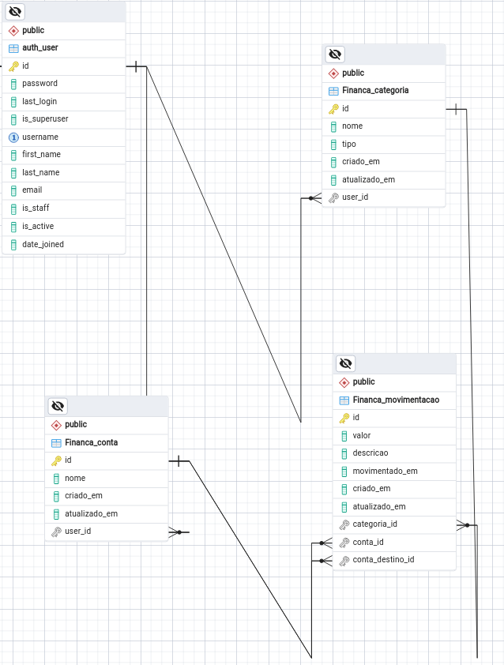

# PROJETO API PYTHON-DJANGO - FRONTEND REACT NATIVE

# INICIAR O PROJETO BACKEND:
```
virtualenv venv
source venv/bin/activate
pip install -r requirements.txt
cd backend
python3 manage.py makemigrations
python3 manage.py migrate
python3 manage.py createsuperuser
python3 manage.py runserver 172.16.4.17:8000

```

# INICIAR O PROJETO FRONTEND:
```
cd frontend
npm install
npm start

```


# Sistema de Gestão Financeira

Este projeto consiste em uma aplicação de gestão financeira para controle de receitas, despesas e transferências, permitindo aos usuários gerenciar suas finanças de forma eficiente.

## Requisitos Funcionais

- **RF-01:** Cadastro de usuários com autenticação segura.
- **RF-02:** Registro de movimentações.
- **RF-03:** Criação, edição e exclusão de categorias para movimentações financeiras.
- **RF-04:** Visualização de gráficos com análise de receitas e despesas por período.
- **RF-05:** Cadastro e gerenciamento de contas associadas às movimentações.
- **RF-06:** Logout.

# Diagrama de classe


# Diagrama de caso de uso


# EXECUTAR O BACKEND:
```
python3 manage.py runserver 172.16.4.17:8000
```

# COMANDOS ESENCIAIS:
```
pip freeze > requirements.txt
django-admin startproject backend
```

# MIGRAÇÕES:
```
python3 manage.py makemigrations
python3 manage.py migrate
```


# SUPER USUARIO:
```
python3 manage.py createsuperuser
```


